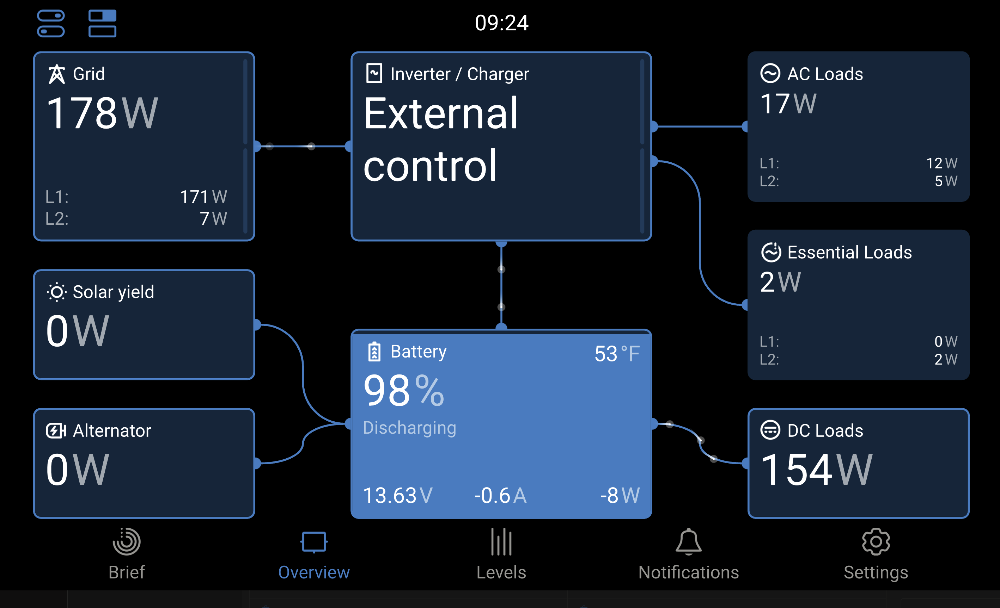
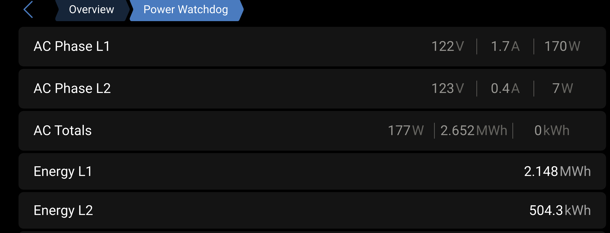

# dbus-power-watchdog

Venus OS service that discovers and manages Hughes Power Watchdog surge
protectors via Bluetooth Low Energy.

## Overview

A single-process Venus OS service that scans BLE for Power Watchdog devices
and presents them as dimmable switches in the Venus OS switches pane.  When
a device is enabled, the service connects to it via BLE and publishes
L1/L2 AC voltage, current, power, energy, and frequency to the Venus OS
D-Bus.

**Only one Power Watchdog device may be active at a time.**  Enabling a
device automatically disables any previously active one.  Each device's
switch includes a slider to control the polling interval (100ms-10000ms).

Supports role assignment as a grid meter, generator meter, or PV inverter
meter.  Settings (role, custom name, position, polling interval) are
persisted via `com.victronenergy.settings` and survive reboots.

Supports both 30A (single-line) and 50A (dual-line L1+L2) Power Watchdog
models, including gen1 (BT-only) and gen2 (WiFi+BT) hardware.

### Cerbo GX Screenshots

**Overview dashboard** — Power Watchdog reporting as the grid meter (178W across L1+L2), with AC Loads, Essential Loads, DC Loads, battery, and inverter status all visible:



**Power Watchdog device detail** — per-phase AC voltage, current, power, and cumulative energy totals:



**Switch panel** — Discovery toggle, system setting overrides, and the per-device polling interval slider (shown at 500ms):


## Architecture

```
dbus-power-watchdog.py          (single process — discovery + BLE + grid service)
  ├─ Registers as com.victronenergy.switch.power_watchdog
  ├─ Discovery toggle in Venus OS switches pane
  ├─ Per-device dimmable switches (on/off + polling interval slider)
  ├─ "Report AC Input Loads" system toggle (HasAcInLoads)
  ├─ "Use Inverter Metering" system toggle (RunWithoutGridMeter)
  └─ When a device is enabled:
       ├─ Connects to the Power Watchdog via BLE (daemon thread)
       └─ Registers com.victronenergy.grid.power_watchdog_{mac_id}
```

Only one device may be active at a time.  Enabling a second device
automatically disables the first.  `power_watchdog_device.py` is retained
as a standalone fallback for manual use.

## Sensors

- **Line 1**: Voltage (V), Current (A), Power (W), Energy (kWh), Frequency (Hz)
- **Line 2**: Voltage (V), Current (A), Power (W), Energy (kWh), Frequency (Hz)
- **Combined**: Total Power (W), Total Current (A), Average Voltage (V), Total Energy (kWh)
- **Error Code**: 0-9 (see Hughes documentation)

## D-Bus Paths

Each enabled device registers as `com.victronenergy.grid.power_watchdog_{mac}`
(or `genset`/`pvinverter` depending on role).

| Path | Description |
|------|-------------|
| `/Role` | Current role (writable: `grid`, `pvinverter`, `genset`) |
| `/AllowedRoles` | Available roles |
| `/Position` | PV inverter position (writable, only used when role=pvinverter) |
| `/CustomName` | User-defined name (writable, persisted) |
| `/NrOfPhases` | Number of phases (1 or 2, auto-detected) |
| `/RefreshTime` | Measurement interval in milliseconds |
| `/Ac/L1/*` | Line 1 measurements |
| `/Ac/L2/*` | Line 2 measurements (50A models) |
| `/Ac/Power` | Total AC power (W) |
| `/ErrorCode` | Current error code |

## Device Discovery

The service scans BLE for two naming patterns:

| Generation | BLE Name Pattern | Example |
|------------|-----------------|---------|
| Gen2 (WiFi+BT) | `WD_{type}_{serial}` | `WD_E7_26ec4ae469a5` |
| Gen1 (BT-only) | `PM{S\|D}...` (19 chars) | `PMD...` (50A), `PMS...` (30A) |

Scanning handles BLE InProgress errors with retry and adapter rotation.

## Requirements

- Venus OS (Cerbo GX or similar)
- Hughes Power Watchdog with Bluetooth (gen1 or gen2)
- BLE adapter available on the GX device

## Installation

### One-Line Remote Install

```bash
ssh root@<cerbo-ip> "curl -fsSL https://raw.githubusercontent.com/TechBlueprints/dbus-power-watchdog/main/install.sh | bash"
```

### Manual Installation

```bash
ssh root@<cerbo-ip>
cd /data/apps
git clone https://github.com/TechBlueprints/dbus-power-watchdog.git
cd dbus-power-watchdog
bash enable.sh
```

## Usage

1. Install the service (see above)
2. Open the Venus OS Remote Console or VRM
3. Navigate to **Settings > I/O > Switches** (or the device list)
4. Find "Power Watchdog Manager" and enable **Device Discovery**
5. Discovered Power Watchdog devices will appear as dimmable switches
6. Enable a device to start reading AC data (only one may be active at a time)
7. Use the slider to adjust the polling interval (100ms-10000ms)
8. The device will appear as a grid meter (or genset/pvinverter after role change)

## System Settings (GUI Controls)

The Power Watchdog Manager pane exposes additional controls beyond the
discovery toggle.  Each discovered device has its own polling interval
slider (see below), and two system-level toggles affect how Venus OS
interprets your system topology.

### Per-Device Polling Interval

**Persistent setting:** `/Settings/Devices/power_watchdog/Device_{mac_id}/PollIntervalMs`
**Default:** 5000ms (slider position 50)

Each discovered Power Watchdog device appears as a **dimmable switch**
(Type 2) in the Venus OS switches pane.  The switch has two controls:

- **State** (on/off): Enables or disables the BLE connection for this device
- **Dimming** (slider 1-100): Controls the polling interval

Each slider step is 100ms:

| Slider | Interval | Notes |
|--------|----------|-------|
| 1 | 100ms | Fastest; highest BLE traffic |
| 50 | 5000ms | Default; good balance of responsiveness and efficiency |
| 100 | 10000ms | Slowest; lowest BLE overhead |

The switch name label updates in real-time to show the current interval,
e.g. `WD_E7_26ec4ae469a5 (5000ms)`.

Slider changes are **debounced by 5 seconds** before taking effect.  This
prevents rapid GUI dragging from causing excessive BLE rescheduling.  The
interval is persisted per device and restored on reboot.

### Report AC Input Loads (`HasAcInLoads`)

**D-Bus setting:** `/Settings/SystemSetup/HasAcInLoads`
**Default:** ON (1)

Tells Venus OS that there are loads wired between the grid meter and the
inverter's AC input.  When enabled, `dbus-systemcalc-py` calculates
`/Ac/ConsumptionOnInput` as the difference between the grid meter reading
and the inverter AC-in reading, and publishes it separately from
`/Ac/ConsumptionOnOutput`.

| Setting | Cerbo GUI | VRM Portal |
|---------|-----------|------------|
| **ON** | Shows separate "AC Loads" (input-side) and "Essential Loads" (output-side) tiles | "AC Loads" tile shows input-side consumption instead of "-" |
| **OFF** | Shows a single "AC Loads" tile using total `/Ac/Consumption` | "AC Loads" tile shows "-" (blank) |

**Recommendation:** Leave ON if you have any loads between the Power Watchdog
and the inverter (e.g., shore power outlets, HVAC).  Turn OFF for the
simplest display if the Power Watchdog is wired directly to the inverter
with nothing in between.

### Use Inverter Metering (`RunWithoutGridMeter`)

**D-Bus setting:** `/Settings/CGwacs/RunWithoutGridMeter`
**Default:** OFF (0)

Controls whether Venus OS uses the external grid meter (Power Watchdog) or
the inverter's internal metering for system calculations.

| Setting | Behavior | VRM Portal |
|---------|----------|------------|
| **OFF** (default) | Power Watchdog is the authoritative grid meter; system calculations use its readings | Shows "Essential Loads" / "Non-Essential Loads" layout; **DC Loads tile is hidden** (known VRM limitation) |
| **ON** | Inverter internal metering is authoritative; Power Watchdog readings are display-only | Shows standard layout with "DC Loads" tile visible; Power Watchdog data still appears but is not used for system calculations |

**Recommendation:** Leave OFF for accurate grid metering.  Only turn ON if
you specifically need DC Loads visible on the VRM portal and accept that
the Power Watchdog's readings become informational rather than
authoritative.

### Known VRM Portal Limitation

The VRM portal (`vrm.victronenergy.com`) is a closed-source application with
rendering logic that differs from the local Cerbo GUI and the
`venus-html5-app`.

When an external grid meter is active (`RunWithoutGridMeter = 0`), VRM uses
an ESS-style layout that:

- Hides the **DC Loads** tile entirely (even though `/Dc/System/Power` is
  correctly published on D-Bus)
- Splits consumption into **Essential Loads** (AC output) and
  **Non-Essential Loads** (AC input) instead of showing a single AC Loads
  value

This is a [known, long-standing VRM limitation](https://github.com/victronenergy/venus/issues/1590)
based on an old design assumption that systems with external grid meters
do not have DC loads.  It affects all external grid meter drivers, including
Victron-maintained ones like `dbus-cgwacs` and `dbus-shelly`.  We filed
[venus#1590](https://github.com/victronenergy/venus/issues/1590) to track
this with Victron.

The local Cerbo GUI and `venus-html5-app` (used on MFDs) render correctly
in all configurations -- they show DC Loads whenever `/Dc/System/Power` has
a value, and use `/Ac/Consumption` for AC Loads without the ESS split.

No D-Bus workaround exists; the fix requires a VRM portal UI change by
Victron Energy.

## Configuration

Optional: copy `config.default.ini` to `config.ini` to customize:

```ini
[DEFAULT]
scan_interval = 60
bluetooth_adapters = hci0,hci1
reconnect_delay = 10
reconnect_max_delay = 120
```

The polling interval is configured per-device via the GUI slider (see above)
and is not in the config file.  All other configuration is optional.  By
default the service auto-detects adapters and uses sensible defaults.

## Service Management

```bash
svc -u /service/dbus-power-watchdog  # Start
svc -d /service/dbus-power-watchdog  # Stop
svc -t /service/dbus-power-watchdog  # Restart
svstat /service/dbus-power-watchdog  # Status
tail -f /var/log/dbus-power-watchdog/current | tai64nlocal  # Logs
```

## Credits

- BLE protocol based on prior open-source work by
  [spbrogan](https://github.com/spbrogan) and
  [tango2590](https://github.com/tango2590/Hughes-Power-Watchdog)
- Venus OS D-Bus integration patterns from
  [dbus-ble-advertisements](https://github.com/TechBlueprints/dbus-ble-advertisements)

## Third-Party Software

This project includes [velib_python](https://github.com/victronenergy/velib_python)
by Victron Energy BV, located in `ext/velib_python/`. It is licensed under the
MIT License:

> Copyright (c) 2014 Victron Energy BV
>
> Permission is hereby granted, free of charge, to any person obtaining a copy
> of this software and associated documentation files (the "Software"), to deal
> in the Software without restriction, including without limitation the rights
> to use, copy, modify, merge, publish, distribute, sublicense, and/or sell
> copies of the Software, and to permit persons to whom the Software is
> furnished to do so, subject to the following conditions:
>
> The above copyright notice and this permission notice shall be included in
> all copies or substantial portions of the Software.
>
> THE SOFTWARE IS PROVIDED "AS IS", WITHOUT WARRANTY OF ANY KIND, EXPRESS OR
> IMPLIED, INCLUDING BUT NOT LIMITED TO THE WARRANTIES OF MERCHANTABILITY,
> FITNESS FOR A PARTICULAR PURPOSE AND NONINFRINGEMENT.

The full MIT license text is available at [`ext/velib_python/LICENSE`](ext/velib_python/LICENSE).

## License

Apache License 2.0 - see [LICENSE](LICENSE)
